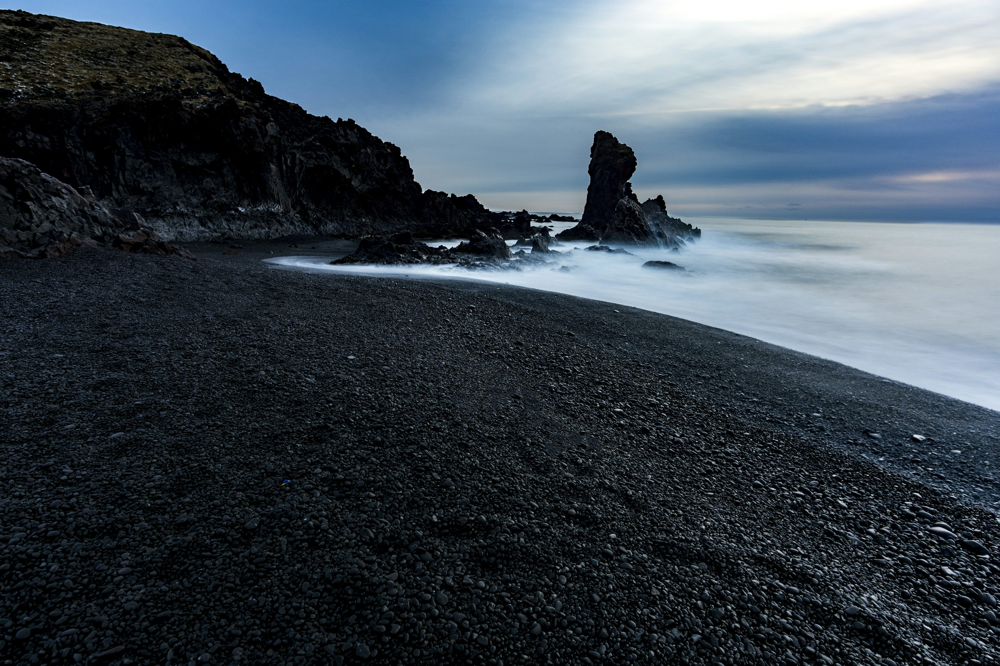

<!--
class: title
-->

# Custome Themeを適用する

タイトルと、本体スライドのデザインは、classを分けました

---
<!--
class: slides
_footer: 'Photo by Michal Vasko　on Unsplash'
paginate: true
-->

# グラデーションのタイトル文
## 直下に各スライドのリード文をh2 `##` で入れる。

本文の表示位置は変えていません。

- 箇条書きなどは
- このとおり

---
<!--
_backgroundColor: white
_footer: 'Photo by Chris Campbell, Dan on Unsplash'
-->

# 進め、新しいわたし。
## 同様に、h1 `#` でタイトル、  h2 `##` でリード文。

自分のテーマが徐々に仕上がってきました。ここからは、皆さんのアレンジ次第!
