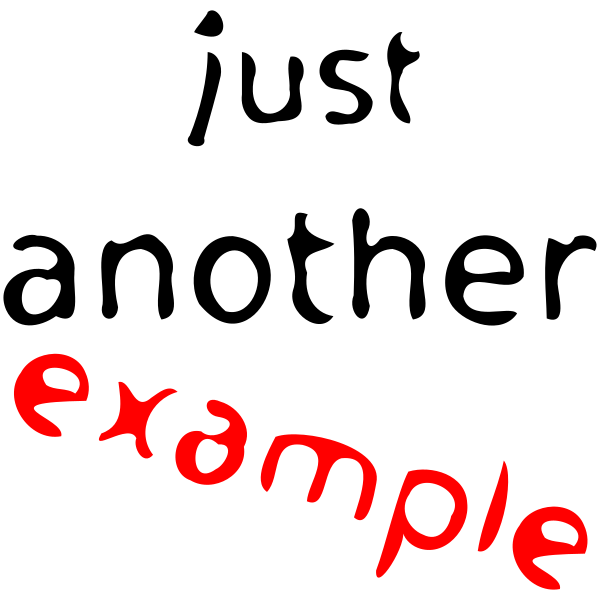

<!--
_footer: 'SVG: The SVG logo (W3C, CC BY 3.0)'
-->

# SVG画像を使う

Marpでは`.svg`もそのまま挿入できます

---
<!--
paginate: true
_footer: 'SVG: Tux by Larry Ewing / lewing@isc.tamu.edu'
-->

### 拡大しても劣化しない

- SVGはベクター形式
- どれだけ拡大しても輪郭がくっきり
- ロゴやアイコンに最適

---
<!--
_backgroundColor: white
-->

  

# 複数のSVGを並べる

サイズを揃えて横並びに表示
